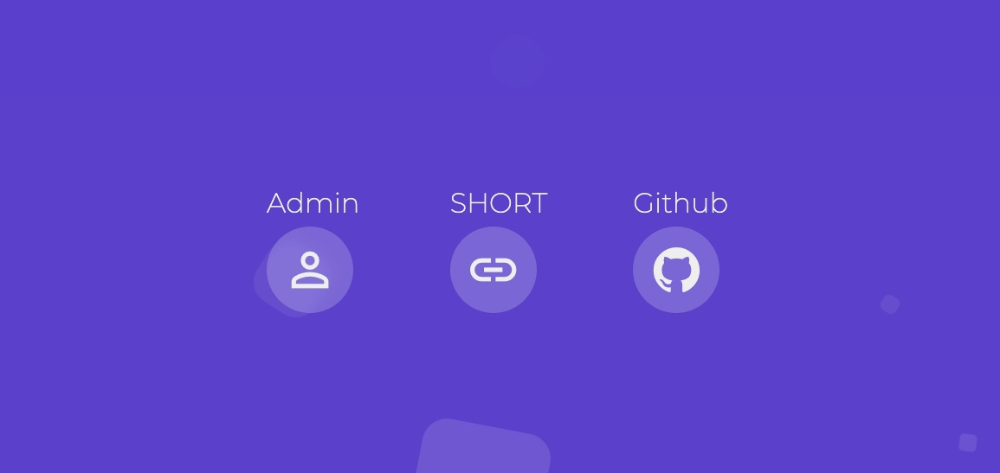

# urpl.io - Simple link shortener

Web application for shortening links. There is an admin panel where you can change links or delete them. 
No responsive design, but you can fix it.



# Before you start

##### Get all the files from the '/src' folder to the root folder of your empty domain

##### Upload db.sql to MySQL

##### Change the connection to your database in the file (app/config/AppConfiguration.php)

```php

public static $db_config = [
        'hostname' => 'your_host',
        'username' => 'your_db_user',
        'password' => 'db_user_password',
        'database' => 'your_db',
        'charset'  => 'utf8' // Or your charset
      ];

```

##### To change the login information for the admin panel, you will also have to change the variable in the same file


```php

public static $admin = [
        'login' => 'your_login',
        'password' => 'your_password'
      ];

```

#### Debuging

```php

debug('Your variable or function'); 

```


## Written based on

* [PHP 7.4](https://www.php.net/downloads.php#v7.4.16)
* [Jquery.js](https://electronjs.org/)
* [TweenMax.js](https://greensock.com/tweenmax)
* [Bootstrap 5](https://getbootstrap.com/)
* [Pure Css Animated Background](https://codepen.io/mohaiman/pen/MQqMyo)

## Authors

* [Munovv](https://github.com/Munovv)

